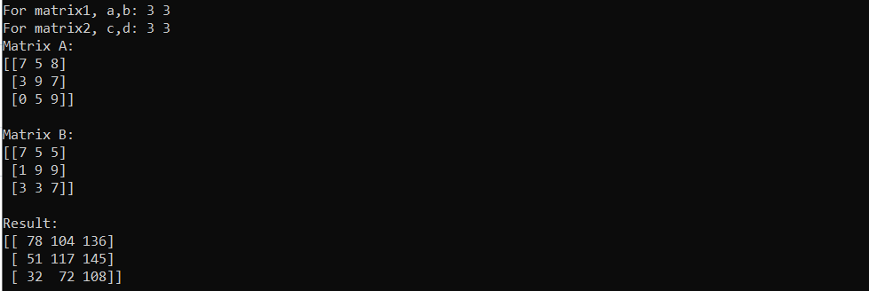

# Multiprocess-Computing
## Использование параллельного программирования

### Цель работы

Научиться использовать многопроцессность как основу параллельного программирования с помощью модуля multiprocessing

### Задания для выполнения

1. Написать программу, перемножающую две матрицы поэлементно. Элементы матрицы-произведения должны вычисляться в несколько потоков.
2. Программа должна читать две матрицы из исходных файлов. Матрица-произведение также должна записываться в файл.
3. Используйте пул процессов, чтобы распределять вычисления между определенным заранее количеством процессов, не зависящим от размеров матрицы.
4. Модифицируйте программу, чтобы элементы результирующей матрицы записывались в промежуточный файл сразу по факту их вычисления.

### Решение задач находится в файле: matrix4.py

### Дополнительные задания

1. Модифицируйте программу таким образом, чтобы она сама определяла количество необходимых параллельных потоков.
2. Модифицируйте программу таким образом, чтобы одна часть программы генерировала случайные квадратные матрицы заданной размерности, а другая - перемножала их по мере генерации. Протестируйте асинхронность работы программы. Реализуйте механизм остановки процесса перемножения.

### Решение задач находится в файле: Async_parallel_multiply.py
Вывод программы:

